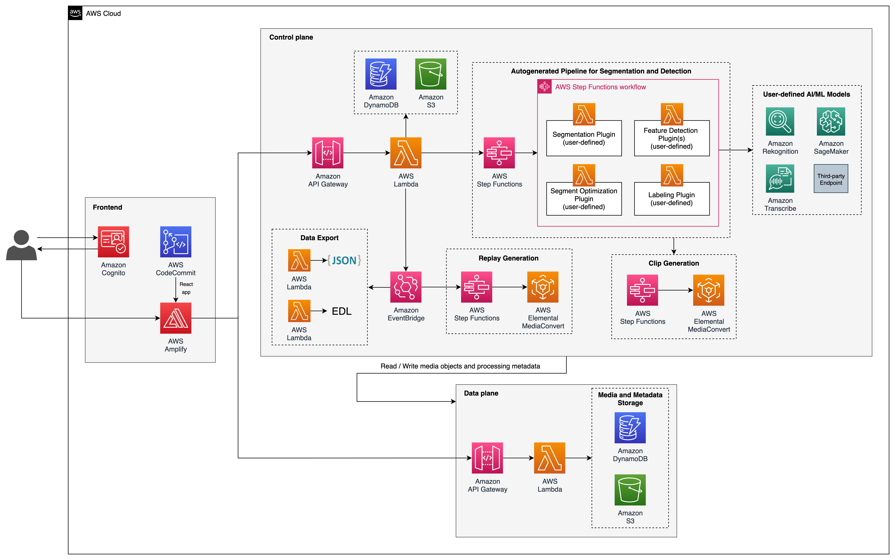
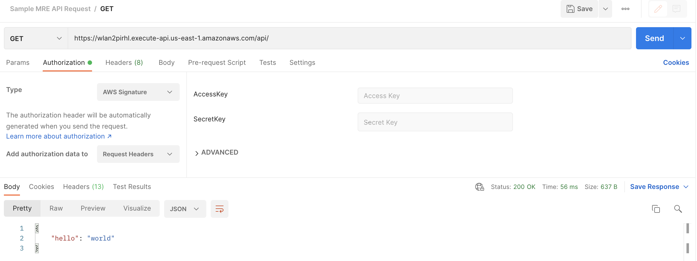

Media Replay Engine (MRE) is a framework for building automated video clipping and replay (highlight) generation pipelines using AWS services for live and video-on-demand (VOD) content. With MRE, you can focus on building the business logic around video clipping without worrying about pipeline orchestration, data movement and persistence.

MRE supports the following features:

* Catchup Replay generation
* After event Replay generation
* Integration with MediaLive for processing live or VOD content
* Event and Replay video export in MP4 and HLS formats
* Event and Replay data export in EDL and JSON formats

This repository contains the core `MRE Framework` which is a set of secure REST APIs that you can interact with directly. It also contains the `MRE Frontend` application built using React if you are someone who prefers the ease-of-use of a graphical user interface (GUI) to interact with the APIs.

To get a head start building automated video clipping pipelines using the MRE framework, check out the [MRE Samples](https://github.com/aws-samples/aws-media-replay-engine-samples) repository which contains sample Plugins and ML Model Notebooks for performing feature detection for clip selection and prioritization.

# Install

## Prerequisites

* python >= 3.8
* aws-cli
* aws-cdk < 2.0
* docker
* node >= 10.13.0
  - ⚠️ versions `13.0.0` to `13.6.0` are not supported due to compatibility issues with the CDK dependencies.
* npm >= 5.6
* git

> **NOTE:** If using an AWS Cloud9 environment to install MRE, please be aware that by default the Cloud9 environment comes with an EBS volume sized at 10 GB out of which only ~2 GB is usable. To avoid errors during installation, please resize the EBS volume to at least 15 GB by following [this guide](https://docs.aws.amazon.com/cloud9/latest/user-guide/move-environment.html#move-environment-resize).

## Build from scratch and deploy using AWS CDK

Run the following commands to build and deploy MRE from scratch. Be sure to define values for `REGION` and `VERSION` first.

```
REGION=[specify a region in a format like us-east-1]
VERSION=1.0.0
git clone https://github.com/awslabs/aws-media-replay-engine
cd aws-media-replay-engine
cd deployment
./build-and-deploy.sh --version $VERSION --region $REGION [--profile <aws-profile>]
```

## Outputs

If you choose to interact with the MRE framework using the REST APIs directly, you will need the below information from the **Outputs** tab of the Controlplane CloudFormation stack:

* **EndpointURL** is the endpoint for accessing the APIs to create, read, update, delete (CRUD) Plugins, Models, Profiles, and schedule Events, Replays for processing.


# Architecture Overview



## Architecture Components

### Control plane
The control plane is an API Gateway endpoint that includes APIs to create and manage different components of the video clipping and highlights generation process. These include:

* `Segmentation and Detection Pipeline` - An AWS Step Functions state machine generated dynamically with one or more user-defined Plugins (Lambda functions) to identify the mark-in (start) and mark-out (end) timestamp of the segments (clips) as well as detect interesting actions happening within those segments. To help decide the outcome of its analysis, a Plugin can optionally depend on a user-defined AI/ML model hosted either in AWS using services such as Rekognition, SageMaker, etc. or outside AWS. The pipeline is also configured to automatically publish different segmentation event notifications to an EventBridge event bus monitored by MRE for event-based downstream processing.
* `Clip Generation` - A pre-defined AWS Step Functions state machine that is invoked as a part of the Segmentation and Detection pipeline to generate MP4 preview clips (for the GUI) and HLS manifest using the mark-in and mark-out timestamps of the identified segments. Clip generation, like the Segmentation and Detection pipeline, sends clip related event notifications to the MRE EventBridge event bus. 
* `Replay Generation` - Another pre-defined AWS Step Functions state machine which automatically selects segments containing key events to create Replay (Highlight) in various resolutions in popular video formats such as HLS and MP4. Replays can be chosen to be created in Catchup mode or after an Event is fully streamed and is completely event driven via Amazon EventBridge rules.
* `Data Export` - Exports Event and Replay data into popular formats such as EDL and JSON via clip generation events triggered through Amazon EventBridge. This data can be optionally enriched (via a custom process) and ingested into video editing systems to create engaging fan user experience by overlaying video and other key event data on a timeline.

### Data plane
The data plane is an API Gateway endpoint that includes APIs using which the Plugins within the Segmentation and Detection pipeline can store and retrieve media assets as well as the processing metadata. There are also quite a few helper APIs available in the data plane that the Plugins can use for performing complex data queries and manipulations.

## Code Layout

| Path | Description |
|:---  |:------------|
| deployment/ |	shell scripts and Dockerfile |
| deployment/build-and-deploy.sh | shell script to build and deploy the solution using AWS CDK |
| deployment/lambda_layer_factory/Dockerfile | install dependencies and create a container image |
| deployment/lambda_layer_factory/docker-entrypoint.sh | shell script to build and package the Lambda layers as zip files within the container |
| deployment/lambda_layer_factory/build-lambda-layer.sh | shell script to run docker for building and packaging the Lambda layers |
| docs/	| shell scripts and code to build and deploy the API docs from source |
| source/ | source code folder |
| source/frontend/ | source code folder for the Frontend application |
| source/api/controlplane/ | source code folder for the control plane |
| source/api/controlplane/*/infrastructure/ | control plane CDK application |
| source/api/controlplane/*/runtime/ | control plane Chalice application |
| source/api/dataplane/ | source code folder for the data plane |
| source/api/dataplane/infrastructure/ | data plane CDK application |
| source/api/dataplane/runtime/ | data plane Chalice application |
| source/lib/ | source code folder for the custom Lambda layers |
| source/lib/MediaReplayEnginePluginHelper/	| source code for the MediaReplayEnginePluginHelper library |
| source/lib/MediaReplayEngineWorkflowHelper/ | source code for the MediaReplayEngineWorkflowHelper library |
| source/gateway/infrastructure/ | API Gateway CDK application|
| source/gateway/runtime/ | API Gateway Chalice application|
| source/service-discovery/infrastructure/ | Service Discovery CDK application|
| source/shared/infrastructure/ | Shared resources CDK application|
| source/backend/clipgeneration/infrastructure/ | ClipGeneration CDK application|
| source/backend/clipgeneration/runtime/ | ClipGeneration related Lambda functions|
| source/backend/data_export/infrastructure/ | Data Export CDK application|
| source/backend/data_export/runtime/ | Data Export related Lambda functions|
| source/backend/event_completion_handler/infrastructure/ | Event completion CDK application|
| source/backend/event_completion_handler/runtime/ | Event completion related Lambda functions|
| source/backend/event_scheduler/infrastructure/ | Event Scheduler CDK application|
| source/backend/event_scheduler/runtime/ | Event Scheduler related Lambda functions|
| source/backend/replay/infrastructure/ | Replay CDK application|
| source/backend/replay/runtime/ | Replay related Lambda functions|
| source/backend/workflow_trigger/infrastructure/ | Workflow Trigger CDK application|
| source/backend/workflow_trigger/runtime/ | Workflow Trigger related Lambda functions|

## Demo

Check out `Create automated intelligent highlights and replays` in [AWS M&E Demo Landing Page](https://pages.awscloud.com/AWS_for_ME_Demo_Showcase_2021.html) to watch a demo of an automated Football (Soccer) video clipping pipeline built using MRE.


# Developers

To know more about how MRE works and for instructions on how to build a  video clipping application with MRE, refer to the [Developer Guide](MRE-Developer-Guide.md).

## Security

MRE uses AWS_IAM to authorize REST API requests for both the Control and Data planes. The following screenshot shows how to test authentication to the MRE Control plane API using Postman. Be sure to specify the `AccessKey` and `SecretKey` for your own AWS environment.



## Run the MRE Frontend application locally

1. Navigate to `source/frontend` folder.
2. Duplicate `env.template` and rename the duplicated file to `.env`.
3. Update the keys in `.env` with values from the **Outputs** tab of `mre-frontend` stack in AWS CloudFormation console.
4. Once the values are updated, run the below commands:
```
npm install

npm start
```

# Cost

You are responsible for the cost of the AWS services used while running this solution.

### Approximate cost (excluding free tiers):

| AWS Service | Quantity | Cost |
| --- | --- | --- |
| Amazon API Gateway | 150000 requests | $0.16 |
| Amazon DynamoDB | 750000 writes, 146250 reads, 0.30 GB storage | $1.18 |
| AWS Lambda | 12000 invocations, 2-minute avg. duration, 256 MB memory | $6 |
| AWS Step Functions | 92400 state transitions | $2.21 |
| Amazon S3 | 10 GB storage, 4000 PUT requests, 4000 GET requests | $0.26 |
| AWS Elemental MediaConvert | 240 minutes | $4.08 |
| Amazon Rekognition | 9000 Image analysis, 3 Custom Label inference units | $22.32 |
| Amazon SageMaker | 2 inference endpoints | $5.13 |

These cost estimates are for a video clipping and replay (highlight) generation pipeline built using MRE to segment a Tennis game with a duration of 3 hours. This specific pipeline had a total of 4 plugins included in the profile (with 2 of those plugins using Machine Learning models hosted in Rekognition and SageMaker). At the end of the game, the pipeline outputted a total of 282 Tennis clips.

> **NOTE:** For tips on how to reduce the processing cost of a pipeline built using MRE, please refer to the Developer Guide.


# Limitations

While MRE deploys all the relevant AWS resources to facilitate automated video clipping and replay generation pipelines, you are still responsible for managing the service limits of those AWS resources via either [AWS Service Quotas](https://console.aws.amazon.com/servicequotas/home) or [AWS Support Center](https://console.aws.amazon.com/support/home).


# Uninstall

## Option 1: Uninstall using AWS CDK
```
# Delete the Frontend stack
cd aws-media-replay-engine/source/frontend/cdk
cdk destroy [--profile <aws-profile>]

# Delete the Gateway API stack
cd aws-media-replay-engine/source/gateway/cdk
cdk destroy [--profile <aws-profile>]

# Delete the service-discovery stack
cd aws-media-replay-engine/source/service-discovery/cdk
cdk destroy [--profile <aws-profile>]

# Delete the Dataplane stack
cd aws-media-replay-engine/source/api/dataplane/infrastructure
cdk destroy [--profile <aws-profile>]

# Delete the Controlplane stacks 
cd aws-media-replay-engine/source/api/controlplane/replay/infrastructure
cdk destroy [--profile <aws-profile>]

cd aws-media-replay-engine/source/api/controlplane/event/infrastructure
cdk destroy [--profile <aws-profile>]

cd aws-media-replay-engine/source/api/controlplane/workflow/infrastructure
cdk destroy [--profile <aws-profile>]

cd aws-media-replay-engine/source/api/controlplane/profile/infrastructure
cdk destroy [--profile <aws-profile>]

cd aws-media-replay-engine/source/api/controlplane/plugin/infrastructure
cdk destroy [--profile <aws-profile>]

cd aws-media-replay-engine/source/api/controlplane/model/infrastructure
cdk destroy [--profile <aws-profile>]

cd aws-media-replay-engine/source/api/controlplane/system/infrastructure
cdk destroy [--profile <aws-profile>]

cd aws-media-replay-engine/source/api/controlplane/contentgroup/infrastructure
cdk destroy [--profile <aws-profile>]

cd aws-media-replay-engine/source/api/controlplane/program/infrastructure
cdk destroy [--profile <aws-profile>]

# Delete the remaining stacks

cd aws-media-replay-engine/source/backend/workflow_trigger/infrastructure
cdk destroy [--profile <aws-profile>]

cd aws-media-replay-engine/source/backend/replay/infrastructure
cdk destroy [--profile <aws-profile>]

cd aws-media-replay-engine/source/backend/event_scheduler/infrastructure
cdk destroy [--profile <aws-profile>]

cd aws-media-replay-engine/source/backend/event_completion_handler/infrastructure
cdk destroy [--profile <aws-profile>]

cd aws-media-replay-engine/source/backend/data_export/infrastructure
cdk destroy [--profile <aws-profile>]

cd aws-media-replay-engine/source/backend/clipgeneration/infrastructure
cdk destroy [--profile <aws-profile>]

cd aws-media-replay-engine/source/shared/infrastructure
cdk destroy [--profile <aws-profile>]
```

## Option 2: Uninstall using the AWS Management Console
1. Sign-in to the AWS CloudFormation console.
2. Select the MRE Frontend stack.
3. Choose Delete.
4. Select the aws-mre-gateway stack.
5. Choose Delete.
6. Select the aws-mre-service-discovery stack.
7. Choose Delete.
8. Select the MRE Dataplane stack (aws-mre-dataplane).
9. Choose Delete.
10. Select all Controlplane stacks with the prefix "aws-mre-controlplane-" and delete them in the the order 
as outlined in the section **option 1 (Uninstall using AWS CDK)**.
11. Select and delete the following stacks
    1. aws-mre-workflow-trigger
    2. aws-mre-replay-handler
    3. aws-mre-event-scheduler
    4. aws-mre-event-completion-handler
    5. aws-mre-data-exporter
    6. aws-mre-clip-generation
    7. aws-mre-shared-resources


## Option 3: Uninstall using AWS Command Line Interface
```
aws cloudformation delete-stack --stack-name <frontend-stack-name> --region <aws-region>

aws cloudformation delete-stack --stack-name <gateway-stack-name> --region <aws-region>

aws cloudformation delete-stack --stack-name <service-discovery-stack-name> --region <aws-region>

aws cloudformation delete-stack --stack-name <dataplane-stack-name> --region <aws-region>

```
Repeat this command for all stacks with the prefix **aws-mre-controlplane-**
Delete the controlplane stacks in the the order as outlined in the section **option 1 (Uninstall using AWS CDK)**.
```
aws cloudformation delete-stack --stack-name <aws-mre-controlplane-*> --region <aws-region>
```

Delete the remaining Stacks
```
aws cloudformation delete-stack --stack-name aws-mre-workflow-trigger --region <aws-region>
aws cloudformation delete-stack --stack-name aws-mre-replay-handler --region <aws-region>
aws cloudformation delete-stack --stack-name aws-mre-event-scheduler --region <aws-region>
aws cloudformation delete-stack --stack-name aws-mre-event-completion-handler --region <aws-region>
aws cloudformation delete-stack --stack-name aws-mre-data-exporter --region <aws-region>
aws cloudformation delete-stack --stack-name aws-mre-clip-generation --region <aws-region>
aws cloudformation delete-stack --stack-name aws-mre-shared-resources --region <aws-region>

```

## Deleting S3 buckets created by MRE
MRE creates 5 S3 buckets that are not automatically deleted. To delete these buckets, follow the steps below:

1. Sign in to the Amazon S3 console.
2. Select the `LambdaLayerBucket` bucket.
3. Choose Empty.
4. Choose Delete.
5. Select the `MreMediaSourceBucket` bucket.
6. Choose Empty.
7. Choose Delete.
8. Select the `MreMediaOutputBucket` bucket.
9. Choose Empty.
10. Choose Delete.
11. Select the `MreDataExportBucket` bucket.
12. Choose Empty.
13. Choose Delete.
14. Select the `MreAccessLogsBucket` bucket.
15. Choose Empty.
16. Choose Delete.

To delete the S3 bucket using AWS CLI, run the following command:
```
aws s3 rb s3://<bucket-name> --force
```


# Contributing

See the [CONTRIBUTING](CONTRIBUTING.md) file for how to contribute.


# License

See the [LICENSE](LICENSE) file for our project's licensing.

Copyright Amazon.com, Inc. or its affiliates. All Rights Reserved.

Unless required by applicable law or agreed to in writing, software distributed under the License is distributed on an "AS IS" BASIS, WITHOUT WARRANTIES OR CONDITIONS OF ANY KIND, either express or implied. 
