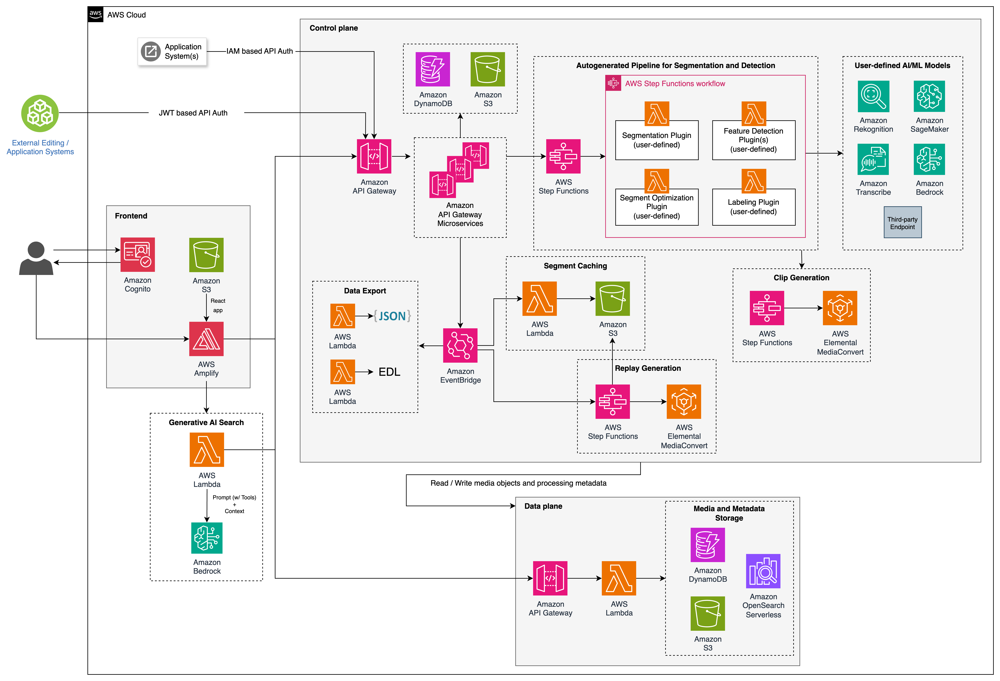

Media Replay Engine (MRE) is a framework for building automated video clipping and replay (highlight) generation pipelines using AWS services for live and video-on-demand (VOD) content. With MRE, you can focus on building the business logic around video clipping without worrying about pipeline orchestration, data movement and persistence.

MRE supports the following features:

* Catchup Replay generation
* After event Replay generation
* Integration with MediaLive for processing live or VOD content
* Event and Replay video export in MP4 and HLS formats
* Event and Replay data export in EDL and JSON formats

This repository contains the core `MRE Framework` which is a set of secure REST APIs that you can interact with directly. It also contains the [MRE Frontend](source/frontend/) application built using React if you are someone who prefers the ease-of-use of a graphical user interface (GUI) to interact with the APIs.

To get a head start in building automated video clipping pipelines using the MRE framework, check out the [MRE Samples](samples/) repository which contains sample Plugins, Profiles and ML Model Notebooks for performing feature detection for clip selection and prioritization.

# Install

## Prerequisites

* python == 3.11
* aws-cli
* aws-cdk >= 2.24.1
* docker
* node >= 20.10.0
* npm >= 10.2.3
* git

## Deploying MRE using EC2

Using an Amazon EC2 Instance is the **SUPPORTED and RECOMMENDED** method to install MRE.
>
> * Use the `env-init.sh` script as User Data when launching your EC2 instance to automatically install all prerequisites. 
> * Please ensure that you configure your EC2 Instance Profile IAM Role with the correct permissions to support CDK (Cloud Development Kit) operations(see `env-role-permissions.json` for policy statement example.).
> * Tested configuration:
>   * *Amazon Linux 2023 (AL2023)*
>   * *Architecture: x86_64*
>   * *Instance Type: t3.large*
>   * *EBS Storage: 16 GB gp3 (minimum requirement)*
>
> * SSH into the EC2 Instance. You will activate the Python virtual environment prior to deployment (see `env-init.sh` for example).
> * Configure a **AWS profile** using the ```aws configure``` command. Ensure that the AWS profile works.
> * Follow steps outlined in section **Greenfield Deployment** to start MRE deployment.

:heavy_exclamation_mark: **IMPORTANT:** You are responsible for stopping or terminating your EC2 instance after deployment to avoid unnecessary charges

## Greenfield Deployment

Greenfield deployment of MRE is suitable for customers who are looking to install from scratch.

Run the following commands to build and deploy MRE. Be sure to define values for `REGION` and `VERSION` first.

```
REGION=[specify the AWS region. For example, us-east-1]
VERSION=2.10.0
git clone https://github.com/awslabs/aws-media-replay-engine
cd aws-media-replay-engine
cd deployment
./build-and-deploy.sh --enable-ssm-high-throughput --version $VERSION --region $REGION [--profile <aws-profile> --admin-email <admin-email>]
```

To deploy MRE with **Generative AI** capabilities, such as natural language clip search, run the following command
```
./build-and-deploy.sh --enable-ssm-high-throughput --enable-generative-ai --version $VERSION --region $REGION [--profile <aws-profile> --admin-email <admin-email>]
```

## Upgrading

### MRE Backend

In order to upgrade MRE Backend (StepFunctions, Lambda, API Gateway, EventBridge Rules, etc.), run the following commands. Be sure to define values for `REGION` and `VERSION` first.

```
REGION=[specify the AWS region. For example, us-east-1]
VERSION=2.10.0
git clone https://github.com/awslabs/aws-media-replay-engine
cd aws-media-replay-engine
cd deployment
./build-and-deploy.sh --disable-ui --version $VERSION --region $REGION [--profile <aws-profile>]
```

### MRE Frontend

MRE uses AWS Amplify which offers a fully managed CI/CD and hosting service to deploy frontend apps on AWS by connecting to a Git repository such as GitHub or GitLab. As a part of MRE Greenfield deployment, AWS Amplify temporarily uses Amazon S3 to store the branch assets while deploying.

To upgrade MRE Frontend to the latest version, follow the below steps. Be sure to define a value for `REGION` which is typically where MRE Frontend is already deployed.

* After cloning the repo from GitHub, navigate to **aws-media-replay-engine/source/frontend/cdk** folder.
* Run the following commands to update the Amplify Environment variables and/or Custom headers.

 ```
 python3 -m venv venv
 source venv/bin/activate
 pip install -r requirements.txt
 ```

 > **NOTE:** The warning message about redeploying the frontend application after running the above command can be ignored as we will be doing that shortly.
* Run ```python3 create-env-file.py $REGION Update```
* Run ```npm i --legacy-peer-deps && npm run build``` from **aws-media-replay-engine/source/frontend** folder
* Navigate to **aws-media-replay-engine/source/frontend/build** folder and zip the build assets using ```zip -r -q -X ./build.zip *```
* Run ```python3 init-amplify.py $REGION Update``` from **aws-media-replay-engine/source/frontend/cdk** folder

#### Run Frontend Locally

If you have the MRE Framework deployed to AWS you can configure and run the MRE frontend without having to redeploy the frontend stack. This can be useful if you want to quickly experiment and tinker with the user interface.

* Firstly you want to configure the frontend to use the correct AWS resources, you can create a .env file in the **aws-media-replay-engine/source/frontend** folder by copying the env.template file (executing ```python3 create-env-file.py $REGION``` will also create a .env file for you)
* Fill in this env file with the correct information, this can all be found in the outputs of the MRE cloudformation stacks.
* Once the .env file is filled you can now install and run the MRE frontend from your local machine with the below commands:

 ```
 npm i --legacy-peer-deps
 npm run start
 ```

* This will install the packages needed by the frontend and then run it on localhost:3000. Be sure that you have Node 20.10.0 installed for this to work as intended.

## Outputs

If you choose to interact with the MRE framework using the REST APIs directly, you will need the below information from the **Outputs** tab of the ControlPlane CloudFormation stack:

* **EndpointURL** is the endpoint for accessing the APIs to create, read, update, delete (CRUD) Plugins, Models, Profiles, and schedule Events, Replays for processing.

# Architecture Overview



## Architecture Components

### Control plane

The control plane is an API Gateway endpoint that includes APIs to create and manage different components of the video clipping and highlights generation process. These include:

* `Segmentation and Detection Pipeline` - An AWS Step Functions state machine generated dynamically with one or more user-defined Plugins (Lambda functions) to identify the mark-in (start) and mark-out (end) timestamp of the segments (clips) as well as detect interesting actions happening within those segments. To help decide the outcome of its analysis, a Plugin can optionally depend on a user-defined AI/ML model hosted either in AWS using services such as Rekognition, SageMaker, etc. or outside AWS. The pipeline is also configured to automatically publish different segmentation event notifications to an EventBridge event bus monitored by MRE for event-based downstream processing.
* `Clip Generation` - A pre-defined AWS Step Functions state machine that is invoked as a part of the Segmentation and Detection pipeline to generate MP4 preview clips (for the GUI) and HLS manifest using the mark-in and mark-out timestamps of the identified segments. Clip generation, like the Segmentation and Detection pipeline, sends clip related event notifications to the MRE EventBridge event bus.
* `Replay Generation` - Another pre-defined AWS Step Functions state machine which automatically selects segments containing key events to create Replay (Highlight) in various resolutions in popular video formats such as HLS and MP4. Replays can be chosen to be created in Catchup mode or after an Event is fully streamed and is completely event driven via Amazon EventBridge rules.
* `Segment Caching` - A custom Lambda function that caches segments and feature data retrieved from DynamoDB on-the-fly (i.e., while an event is being processed) into S3. This cache gets used when generating replays thereby decreasing the overall latency in Replay creation.
* `Data Export` - Exports Event and Replay data into popular formats such as EDL and JSON via clip generation events triggered through Amazon EventBridge. This data can be optionally enriched (via a custom process) and ingested into video editing systems to create engaging fan user experience by overlaying video and other key event data on a timeline.

### Data plane

The data plane is an API Gateway endpoint that includes APIs with which the Plugins within the Segmentation and Detection pipeline can store and retrieve media assets as well as the processing metadata. There are also quite a few helper APIs available in the data plane that the Plugins can use for performing complex data queries and manipulations.

## Generative AI Search

Generative AI search uses a lambda function url to expose an API that embeds user queries, searches through plugin results stored in an OpenSearch Serverless Collection and provides relevant plugin segments for the query. The plugin uses a streaming response to provide results back to the caller.

## Code Layout

| Path | Description |
|:---  |:------------|
| deployment/ | shell scripts and Dockerfile |
| deployment/build-and-deploy.sh | shell script to build and deploy the solution using AWS CDK |
| deployment/lambda_layer_factory/Dockerfile | install dependencies and create a container image |
| deployment/lambda_layer_factory/docker-entrypoint.sh | shell script to build and package the Lambda layers as zip files within the container |
| deployment/lambda_layer_factory/build-lambda-layer.sh | shell script to run docker for building and packaging the Lambda layers |
| docs/ | shell scripts and code to build and deploy the API docs from source |
| samples/ | folder containing sample plugins, profiles, and ML model notebooks |
| source/ | source code folder |
| source/frontend/ | source code folder for the Frontend application |
| source/api/controlplane/ | source code folder for the control plane |
| source/api/controlplane/*/infrastructure/ | control plane CDK application |
| source/api/controlplane/*/runtime/ | control plane Chalice application |
| source/api/dataplane/ | source code folder for the data plane |
| source/api/dataplane/infrastructure/ | data plane CDK application |
| source/api/dataplane/runtime/ | data plane Chalice application |
| source/api/search/infrastructure/ | generative ai search CDK application |
| source/lib/ | source code folder for the custom Lambda layers |
| source/lib/MediaReplayEnginePluginHelper/ | source code for the MediaReplayEnginePluginHelper library |
| source/lib/MediaReplayEngineWorkflowHelper/ | source code for the MediaReplayEngineWorkflowHelper library |
| source/gateway/infrastructure/ | API Gateway CDK application|
| source/gateway/runtime/ | API Gateway Chalice application|
| source/shared/infrastructure/ | Shared resources CDK application|
| source/backend/caching/infrastructure/ | Segment Caching CDK application|
| source/backend/caching/runtime/ | Segment Caching related Lambda functions|
| source/backend/clipgeneration/infrastructure/ | ClipGeneration CDK application|
| source/backend/clipgeneration/runtime/ | ClipGeneration related Lambda functions|
| source/backend/data_export/infrastructure/ | Data Export CDK application|
| source/backend/data_export/runtime/ | Data Export related Lambda functions|
| source/backend/event-life-cycle/infrastructure/ | Event life cycle CDK application|
| source/backend/event-life-cycle/runtime/ | Event life cycle related Lambda functions|
| source/backend/replay/infrastructure/ | Replay CDK application|
| source/backend/replay/runtime/ | Replay related Lambda functions|
| source/backend/workflow_trigger/infrastructure/ | Workflow Trigger CDK application|
| source/backend/workflow_trigger/runtime/ | Workflow Trigger related Lambda functions|

## Demo

Check out `Create automated intelligent highlights and replays` in [AWS M&E Demo Landing Page](https://pages.awscloud.com/AWS_for_ME_Demo_Showcase_2021.html) to watch a demo of an automated Football (Soccer) video clipping pipeline built using MRE.

# Developers

To know more about how MRE works and for instructions on how to build a video clipping application with MRE, refer to the [Developer Guide](MRE-Developer-Guide.md).

## Security

MRE uses AWS_IAM to authorize REST API requests for both the Control and Data planes. The following screenshot shows how to test authentication to the MRE Control plane API using Postman. Be sure to specify the `AccessKey` and `SecretKey` for your own AWS environment.


## Improve HTTPS viewer connection security

The CloudFront distribution deployed by MRE allows for SSLv3 or TLSv1 for HTTPS viewer connections.
However, it is recommended that customers help protect viewer connections by specifying a viewer certificate that enforces a minimum of TLSv1.2 in the security policy. In order to enforce TLSv1.2 in the security policy, update the Cloudfront Distribution by specifying a CNAME and the location of the SSL/TLS certificate. For more information on this, please refer to [Cloudfront Distribution Viewer Certificate](https://docs.aws.amazon.com/AWSCloudFormation/latest/UserGuide/aws-properties-cloudfront-distribution-viewercertificate.html)

### :heavy_exclamation_mark: **Important!**

After a CNAME has been configured for the MRE Cloudfront distribution, be sure to execute the following steps to reflect this change within MRE deployment.

1. Navigate to **AWS Systems Manager** in the AWS Management console. Choose **Parameter store** and replace the value of the parameter **/MRE/ControlPlane/MediaOutputDistribution** with the CNAME of the MRE Cloudfront distribution.
2. Navigate to AWS Amplify in the AWS Management console. Under **All apps**, choose **mre_frontend**. In the left pane, under app settings, choose **Environment Variables**. Change the value of the environment variable **REACT_APP_CLOUDFRONT_DOMAIN_NAME** to the CNAME of the MRE Cloudfront distribution.
3. In the left pane, under app settings, choose **Custom Headers**. Edit the Header information by replacing the the default MRE Cloudfront distribution url with the CNAME of the MRE Cloudfront distribution.
4. Within the AWS Amplify console, under **All apps**, choose **MRE Frontend**. Click on **Build** and then click on **Redeploy this version**. This will redeploy the MRE frontend taking into account the new CNAME for the Cloudfront distribution.

# Cost

You are responsible for the cost of the AWS services used while running this solution.

### Approximate cost (excluding free tiers)

| AWS Service | Quantity | Cost |
| --- | --- | --- |
| Amazon API Gateway | 150000 requests | $0.05 |
| Amazon DynamoDB | 750000 writes, 146250 reads, 0.30 GB storage | $0.13 |
| AWS Lambda | 12000 invocations, 2-minute avg. duration, 256 MB memory | $4.80 |
| AWS Step Functions | 92400 state transitions | $2.21 |
| Amazon S3 | 10 GB storage, 4000 PUT requests, 4000 GET requests | $0.25 |
| AWS Elemental MediaConvert | 240 minutes | $1.80 |
| Amazon Rekognition | 9000 Image analysis, 3 Custom Label inference units | $22.32 |
| Amazon SageMaker | 2 inference endpoints | $5.13 |
| Amazon Bedrock | Embedding 100000 input tokens with Amazon Titan Text Embeddings V2 | $2.00 |
| Amazon OpenSearch Serverless | 10 GB Storage, 1 OCU hour for indexing, 1 OCU hour for search | $0.72 |

These cost estimates are for a video clipping and replay (highlight) generation pipeline built using MRE to segment a Tennis game with a duration of 3 hours. This specific pipeline had a total of 4 plugins included in the profile (with 2 of those plugins using Machine Learning models hosted in Rekognition and SageMaker). At the end of the game, the pipeline outputed a total of 282 Tennis clips.

> **NOTE:** For tips on how to reduce the processing cost of a pipeline built using MRE, please refer to the [Operations Developer Guide](docs/guides/MRE-Developer-Guide-Operations.md).

# Limitations

* While MRE deploys all the relevant AWS resources to facilitate automated video clipping and replay generation pipelines, you are still responsible for managing the service limits of those AWS resources via either [AWS Service Quotas](https://console.aws.amazon.com/servicequotas/home) or [AWS Support Center](https://console.aws.amazon.com/support/home).

* MRE currently uses a custom resource provider (based on Lambda) to work around a known AWS CDK limitation (<https://github.com/aws/aws-cdk/issues/12246>) by creating the DynamoDB GSIs programmatically and polling them periodically to know when they become active. As of today, the custom resource provider in CDK has a maximum timeout limit of 2 hours and in some cases where the PluginResult table has more data (>20 GB), it could cause the Dataplane stack deployment to fail (especially when upgrading MRE to v2.5.1 or later). If this happens to you, please try one of the following workarounds:
  * Delete old and unwanted Events via the MRE Frontend or `DELETE /event/{name}/program/{program}` Controlplane API.
  * Backup existing PluginResult table, purge it, rerun the MRE installer, and then restore the data from backup.

# Uninstall

## Option 1: Uninstall using AWS CDK

```
# Delete the Frontend stack
cd aws-media-replay-engine/source/frontend/cdk
cdk destroy [--profile <aws-profile>]

# Delete the Gateway API stack
cd aws-media-replay-engine/source/gateway/infrastructure
cdk destroy [--profile <aws-profile>]

# Delete the Generative AI Search 
cdk aws-media-replay-engine/source/api/search/infrastructure
cdk destroy [--profile <aws-profile>]

# Delete the Dataplane stack
cd aws-media-replay-engine/source/api/dataplane/infrastructure
cdk destroy [--profile <aws-profile>]

# Delete the Controlplane stacks 
cd aws-media-replay-engine/source/api/controlplane/replay/infrastructure
cdk destroy [--profile <aws-profile>]

cd aws-media-replay-engine/source/api/controlplane/event/infrastructure
cdk destroy [--profile <aws-profile>]

cd aws-media-replay-engine/source/api/controlplane/workflow/infrastructure
cdk destroy [--profile <aws-profile>]

cd aws-media-replay-engine/source/api/controlplane/profile/infrastructure
cdk destroy [--profile <aws-profile>]

cd aws-media-replay-engine/source/api/controlplane/promptcatalog/infrastructure
cdk destroy [--profile <aws-profile>]

cd aws-media-replay-engine/source/api/controlplane/plugin/infrastructure
cdk destroy [--profile <aws-profile>]

cd aws-media-replay-engine/source/api/controlplane/model/infrastructure
cdk destroy [--profile <aws-profile>]

cd aws-media-replay-engine/source/api/controlplane/system/infrastructure
cdk destroy [--profile <aws-profile>]

cd aws-media-replay-engine/source/api/controlplane/contentgroup/infrastructure
cdk destroy [--profile <aws-profile>]

cd aws-media-replay-engine/source/api/controlplane/program/infrastructure
cdk destroy [--profile <aws-profile>]

cd aws-media-replay-engine/source/api/custompriorities/program/infrastructure
cdk destroy [--profile <aws-profile>]

# Delete the remaining stacks

cd aws-media-replay-engine/source/backend/workflow_trigger/infrastructure
cdk destroy [--profile <aws-profile>]

cd aws-media-replay-engine/source/backend/replay/infrastructure
cdk destroy [--profile <aws-profile>]

cd aws-media-replay-engine/source/backend/event-life-cycle/infrastructure
cdk destroy [--profile <aws-profile>]

cd aws-media-replay-engine/source/backend/data_export/infrastructure
cdk destroy [--profile <aws-profile>]

cd aws-media-replay-engine/source/backend/clipgeneration/infrastructure
cdk destroy [--profile <aws-profile>]

cd aws-media-replay-engine/source/backend/caching/infrastructure
cdk destroy [--profile <aws-profile>]

cd aws-media-replay-engine/source/shared/infrastructure
cdk destroy [--profile <aws-profile>]
```

## Option 2: Uninstall using script
1. Execute `uninstall.sh`

## Option 3: Uninstall using the AWS Management Console
1. Sign-in to the AWS CloudFormation console.
2. Select the MRE Frontend stack.
3. Choose Delete.
4. Select the aws-mre-gateway stack.
5. Choose Delete.
6. If you encluded `--enable-generative-ai` as a flag in your MRE deployment, select the aws-mre-genai-search stack, and choose delete
7. Select the MRE Dataplane stack (aws-mre-dataplane).
8. Choose Delete.
9. Select all Controlplane stacks with the prefix "aws-mre-controlplane-" and delete them in the the order
as outlined in the section **Option 1 (Uninstall using AWS CDK)**.
10. Select and delete the following stacks
    1. aws-mre-workflow-trigger
    2. aws-mre-replay-handler
    3. aws-mre-event-scheduler
    4. aws-mre-event-life-cycle
    5. aws-mre-data-exporter
    6. aws-mre-clip-generation
    7. aws-mre-segment-caching
    8. aws-mre-shared-resources

## Option 4: Uninstall using AWS Command Line Interface

```
aws cloudformation delete-stack --stack-name <frontend-stack-name> --region <aws-region>

aws cloudformation delete-stack --stack-name <gateway-stack-name> --region <aws-region>

aws cloudformation delete-stack --stack-name <genai-search-stack-name> --region <aws-region>

aws cloudformation delete-stack --stack-name <dataplane-stack-name> --region <aws-region>
```

Repeat this command for all stacks with the prefix **aws-mre-controlplane-**
Delete the controlplane stacks in the the order as outlined in the section **Option 1 (Uninstall using AWS CDK)**.

```
aws cloudformation delete-stack --stack-name <aws-mre-controlplane-*> --region <aws-region>
```

Delete the remaining Stacks

```
aws cloudformation delete-stack --stack-name aws-mre-workflow-trigger --region <aws-region>
aws cloudformation delete-stack --stack-name aws-mre-replay-handler --region <aws-region>
aws cloudformation delete-stack --stack-name aws-mre-event-scheduler --region <aws-region>
aws cloudformation delete-stack --stack-name aws-mre-event-life-cycle --region <aws-region>
aws cloudformation delete-stack --stack-name aws-mre-data-exporter --region <aws-region>
aws cloudformation delete-stack --stack-name aws-mre-clip-generation --region <aws-region>
aws cloudformation delete-stack --stack-name aws-mre-segment-caching --region <aws-region>
aws cloudformation delete-stack --stack-name aws-mre-shared-resources --region <aws-region>
```

## Deleting S3 buckets created by MRE

MRE creates 5 S3 buckets that are not automatically deleted. To delete these buckets, follow the steps below:

1. Sign in to the Amazon S3 console.
2. Select the `LambdaLayerBucket` bucket.
3. Choose Empty.
4. Choose Delete.
5. Select the `MreMediaSourceBucket` bucket.
6. Choose Empty.
7. Choose Delete.
8. Select the `MreMediaOutputBucket` bucket.
9. Choose Empty.
10. Choose Delete.
11. Select the `MreSegmentCacheBucket` bucket.
12. Choose Empty.
13. Choose Delete.
14. Select the `MreDataExportBucket` bucket.
15. Choose Empty.
16. Choose Delete.
17. Select the `MreAccessLogsBucket` bucket.
18. Choose Empty.
19. Choose Delete.

To delete the S3 bucket using AWS CLI, run the following command:

```
aws s3 rb s3://<bucket-name> --force
```

# Bucket Policy (BYOB)

When utilizing a bucket where you are not the owner, only the bucket owner can configure notifications on a bucket. However, bucket owners can use a bucket policy to [grant permission to other users to set this configuration with s3:PutBucketNotification permission.](https://docs.aws.amazon.com/AmazonS3/latest/API/API_PutBucketNotificationConfiguration.html)

```
{
    "Version": "2012-10-17",
    "Statement": [
        {
            "Sid": "TriggerPermission",
            "Effect": "Allow",
            "Principal": {
                "Service": "lambda.amazonaws.com"
            },
            "Action": "s3:PutBucketNotification",
            "Resource": "arn:aws:s3:::{BUCKET_NAME}",
            "Condition": {
                "StringEquals": {
                    "aws:SourceAccount": "{ACCOUNT_NUMBER}"
                }
            }
        }
    ]
}
```

If you have a restrictive bucket policy that would explicitly prevent bucket access when providing your own bucket to MRE workflow- add the following policy to your bucket to allow access

```
{
 "Version": "2012-10-17",
 "Statement": [
  {
   "Sid": "MediaConvertRoleGet",
   "Principal": {
    "AWS": "arn:aws:iam::{ACCOUNT_NUMBER}:role/{MREMediaConvertIamRole from aws-mre-shared-resources stack}"
   },
   "Effect": "Allow",
   "Action": [
    "s3:GetObject",
    "s3:ListBucket"
   ],
   "Resource": [
    "arn:aws:s3:::{BUCKET_NAME}",
    "arn:aws:s3:::{BUCKET_NAME}/*"
   ]
  },
  {
   "Sid": "ProbeVideoRoleGet",
   "Principal": {
    "AWS": "arn:aws:iam::{ACCOUNT_NUMBER}:role/{ProbeVideoLambdaRole from aws-mre-controlplane-profile stack}"
   },
   "Effect": "Allow",
   "Action": [
    "s3:GetObject",
    "s3:ListBucket"
   ],
   "Resource": [
    "arn:aws:s3:::{BUCKET_NAME}",
    "arn:aws:s3:::{BUCKET_NAME}/*"
   ]
  },
  {
   "Sid": "AllowS3Trigger",
   "Principal": {
    "AWS": "arn:aws:iam::{ACCOUNT_NUMBER}:role/{ChaliceRole from aws-mre-controlplane-event stack}"
   },
   "Effect": "Allow",
   "Action": [
    "s3:*BucketNotification*",
   ],
   "Resource": [
    "arn:aws:s3:::{BUCKET_NAME}"
   ]
  },
        {
   "Sid": "AllowS3Selection",
   "Principal": {
    "AWS": "arn:aws:iam::{ACCOUNT_NUMBER}:role/{ChaliceRole from aws-mre-controlplane-system stack}"
   },
   "Effect": "Allow",
   "Action": [
    "s3:List*Bucket*"
   ],
   "Resource": [
    "arn:aws:s3:::{BUCKET_NAME}"
   ]
  }
 ]
}
```

# MRE Security Considerations

## 1. Amazon API Gateway
This solution deploys an Amazon API Gateway REST API and uses the default API endpoint and SSL certificate. The default API endpoint supports TLSv1 security policy. It is recommended to use the TLS_1_2 security policy to enforce TLSv1.2+ with your own custom domain name and custom SSL certificate. For more information, refer to choosing a minimum TLS version for a custom domain in API Gateway as documented in the Amazon API Gateway Developer Guide.

https://docs.aws.amazon.com/apigateway/latest/developerguide/apigateway-custom-domain-tls-version.html
https://docs.aws.amazon.com/apigateway/latest/developerguide/how-to-custom-domains.html


## 2. Amazon Bedrock

### Setting up Bedrock Guardrails

Amazon Bedrock Guardrails helps implement safeguards in your generative AI applications by filtering harmful content and protecting sensitive information. To set up guardrails for MRE:

1. Sign in to the AWS Management Console and open the Amazon Bedrock console.

2. From the left navigation pane, select **Guardrails**, then choose **Create guardrail**.

3. In the **Guardrail details** section:
   - Provide a meaningful name and description for your guardrail
   - Enter appropriate blocked messages for prompts and responses
   - (Optional) Configure custom encryption settings using AWS KMS

4. For **Guardrail creation options**, you can either:
   - Select **Quick create with toxicity filters** to use default settings
   - Choose **Create your own guardrail** to customize settings

5. Configure the following guardrail components as needed:
   - **Content filters** - Block or mask harmful content categories
   - **Denied topics** - Define specific topics to block
   - **Word filters** - Block specific words or phrases
   - **Sensitive information filters** - Configure PII detection and masking

6. After creating the guardrail, note the Guardrail ID as you'll need it to associate with your MRE applications.

7. To use the guardrail with MRE:
   - Update your IAM roles to include permissions for Bedrock Guardrails
   - Associate the guardrail ID when creating or updating MRE agents
   - Monitor guardrail effectiveness through CloudWatch logs

The guardrail will help ensure MRE maintain appropriate content standards and protect sensitive information during processing.

## 3. Use Customer managed KMS key

By default, MRE encrypts data at rest using service's own AWS-owned KMS key. If you want the option to be able to bring your own keys, manage and audit the encryption and decryption of your data, consider encrypting data using Customer owned KMS keys called [Customer Managed Keys(CMKs)](https://docs.aws.amazon.com/kms/latest/developerguide/concepts.html#customer-cmk) . There are multiple options of storing these CMKs. You can use a native KMS key, a key stored in AWS CloudHSM, or an external key store. This allows you to manage access to data based on authorization of the KMS key.


# Enabling Optional Data Export Features

For cost optimization, MRE disables some data export features out of the Box. To enable them, follow these steps.

1. Event Data Export - Within Amazon EventBridge, enable the rule named **aws-mre-data-exporter-MREEventDataExportRule**

2. EDL Export - Within Amazon EventBridge, enable the rule named **aws-mre-clip-generation-MREEventEndRule**

# Contributing

See the [CONTRIBUTING](CONTRIBUTING.md) file for how to contribute.

# License

The [MRE Samples](samples/) is licensed under [MIT-0 license](samples/LICENSE) while the rest of the project is licensed under [Apache-2.0 license](LICENSE).

Copyright Amazon.com, Inc. or its affiliates. All Rights Reserved.

Unless required by applicable law or agreed to in writing, software distributed under the License is distributed on an "AS IS" BASIS, WITHOUT WARRANTIES OR CONDITIONS OF ANY KIND, either express or implied.
