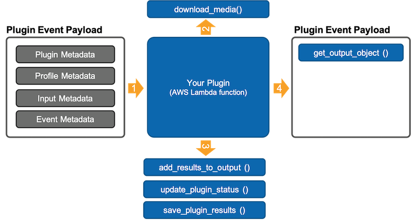

[](../../MRE-Developer-Guide.md)

# Developers Guide - Featurer Plugin

Featurer plugins are responsible for detecting key data about or within the frames of the video chunk being processed. Examples of key data are:
- Data you will need to make decisions about where the start or end of a segment occurs
- Data you need to determine priorities in replay criteria
- Data for labeling a segment
- Data to optimize a segment
- Other data you want to later export with each clip to use for searching, filtering or sorting

As a strategy, it is advised to design plugins with reuse in mind.



**Sample payload event:**

```
{
	'Plugin': {
		'Name': 'TennisSceneClassification',
		'Class': 'Featurer',
		'ExecutionType': 'SyncModel',
		'ModelEndpoint': 'arn:aws:rekognition:us-east-1:99999999999999:project/Tennis-Segmentation/version/Tennis-Segmentation.2021-10-26T16.39.56/1635284396508',
		'DependentPlugins': [],
		'Configuration': {
			'minimum_confidence': '30'
		},
		'OutputAttributes': {
			'Label': {
				'Description': 'output'
			}
		}
	},
	'Profile': {
		'Name': 'TennisProfile',
		'ChunkSize': 20,
		'MaxSegmentLengthSeconds': 120,
		'ProcessingFrameRate': 5,
		'Classifier': {
			'Name': 'Tennis-Segmentation',
			'Configuration': {
				'start_seq': "[['near','far'],['topview','far']]",
				'padding_seconds': '1',
				'end_seq': "[['far','near'],['far','topview']]"
			},
			'DependentPlugins': [{
				'Name': 'TennisSceneClassification',
				'Configuration': {
					'minimum_confidence': '30'
				},
				'SupportedMediaType': 'Video'
			}]
		},
		'Labeler': {
			'Name': 'Tennis-Score-Extraction',
			'Configuration': {},
			'DependentPlugins': [{
				'Name': 'Tennis-ScoreBox-Detection',
				'Configuration': {
					'Minimum-Confidence': '0.6'
				},
				'SupportedMediaType': 'Video'
			}]
		}
	},
	'Input': {
		'ExecutionId': '350c6153-33b7-4ec2-9062-7cad5a574c88',
		'Media': {
			'S3Bucket': 'aws-mre-controlplane-medialivedestinationbucket13-99999999',
			'S3Key': '9999999/TennisProfile/a_tennis_match_00007.ts'
		},
		'Metadata': {
			'HLSSegment': {
				'StartTime': 120.12,
				'StartTimeUtc': '00:02:00.120',
				'StartPtsTime': 122.42,
				'StartPtsTimeUtc': '00:02:02.420',
				'Duration': 20.02,
				'FrameRate': 60
			}
		}
	},
	'Event': {
		'Name': 'SampleTennisMatchEvent',
		'Program': 'Some Big Tennis Tournament',
		'Start': '2021-11-03T16:32:57Z',
		'AudioTracks': [1]
	}
}
```


Use the below input payload if you want the dummy SelectSegments to output a valid “Start” and “End” timestamp for a given chunk:


```
{
    "Plugin": {
        "Name": "TestPlugin",
        "Class": "Classifier",
        "ExecutionType": "Sync",
        "ModelEndpoint": "arn:aws:rekognition:us-east-1:842081126128:project/eurosport-scene-classification-sample/version/eurosport-scene-classification-sample.2021-04-06T15.33.12/1617737593008",
        "DependentPlugins": [],
        "Configuration": {
            "opto_buffer_time_sec": 3
        }
    },
    "Event": {
        "Name": "TestEvent",
        "Program": "TestProgram"
    },
    "Profile": {
        "Name": "TestProfile",
        "ChunkSize": 20,
        "MaxClipLength": 10,
        "ProcessingFrameRate": 5,
        "Classifier": {
            "Name": "ClassifyTennis",
            "DependentPlugins": ["DetectTennisScene"]
        },
        "Optimizer": {
            "Name": "OptimizeTennis",
            "DependentPlugins": [
                {"name": "DetectSilence", "Configuration": {"bias": "safe range"} },
                {"name": "DetectSceneChange", "Configuration": {"bias": "single"} }
             ]
        }
    },
    "TrackNumber": "1",
    "Input": {
        "ExecutionId": "4b2ddef0-8959-41e4-9b1f-d692fedb1102",
        "Media": {
            "S3Bucket": "aws-mre-ml-output",
            "S3Key": "MediaLiveOutput/1/Reeu1200927005_1-YS-3min_1_00008.ts"
        },
        "Metadata": {
            "HLSSegment": {
                "StartTime": 140,
                "StartTimeUtc": "00:02:20.000",
                "StartPtsTime": 142.3,
                "StartPtsTimeUtc": "00:02:22.300",
                "Duration": 20,
                "FrameRate": 25
            }
        }
    }
}
```


**What Lambda permissions does my role need?**

1. LambdaBasicExecution
2. SSMReadOnlyAccess
3. AmazonAPIGatewayInvokeFullAccess
4. Plus whatever else your function needs


**How to get the chunk to act on?**
from MediaReplayEnginePluginHelper import DataPlane

mre_dataplane = DataPlane(event)

# Download the HLS video segment from S3
media_path = mre_dataplane.download_media(bucket, key)

Here, media_path points to the chunk downloaded from S3 to the /tmp directory of Lambda

**How to get plugin parameters?**
Most of the plugin parameters needed for processing will be present in the lambda event payload. The parameters can be retrieved by their name from the “event” payload. For example, to get the model endpoint, use event[“ModelEndpoint”] and to get the configuration chosen for the plugin while creating the profile, use event[“Configuration”].


**How to translate timecode from chunk runtime to UTC?**
(Not really a UTC timecode but rather a chunk-specific timecode. In our solution, chunk is referred to as HLS segment)

from MediaReplayEnginePluginHelper import OutputHelper

mre_outputhelper = OutputHelper(event) # event is the input event payload passed to Lambda

mre_outputhelper.get_segment_absolute_time(1.3) # Assuming a chunk_size of 20 secs, for the first chunk, this will output 1.3 and for the second chunk, this will output 21.3 and so on.


**How to persist plugin results?**
from MediaReplayEnginePluginHelper import DataPlane

mre_dataplane = DataPlane(event)

mre_dataplane.save_plugin_results(results)


**Expected output event for Lambda:**
from MediaReplayEnginePluginHelper import OutputHelper
from MediaReplayEnginePluginHelper import Status

mre_outputhelper = OutputHelper(event) # event is the “complete” event payload passed to Lambda

_*When the plugin processing is successful:*_
# Update the processing status of the plugin (required):
mre_outputhelper.update_plugin_status(Status.PLUGIN_COMPLETE)

# Add the results of the plugin to the payload (required if the plugin status is “complete”; Optional if the plugin has any errors)
mre_outputhelper.add_results_to_output(results) → results is a list of JSON objects/dicts

# Finally, return the output event of Lambda
return mre_outputhelper.get_output_object()

_*When the plugin processing is not successful and has encountered an error:*_
# Update the processing status of the plugin (required):
outputhelper.update_plugin_status(Status.PLUGIN_ERROR)

#

# Finally, return the output event of Lambda
return outputhelper.get_output_object()

**How does the plugin know which audio track to process on?**

event[“TrackNumber”] gives the current audio track of the Step function Map state

**How does the Segmenter plugin know what to look for in the current chunk?**
state, events = mre_dataplane.get_segment_state()

if state is None or state == “End”:
look for “Start”
events = [

]
if state == “Start”:
look for “End”


get_segment_state() outputs a list with 2 items. The first item is one of “Start” (if the last segment result is “Start”), “End” (if the last segment result is “End”), None (if there is no last segment result). The second item is a list which will either be empty (if there is no last segment result) or a list of dictionaries that contains the output of the scene detector plugin since the last start/end (spans across multiple chunks).
