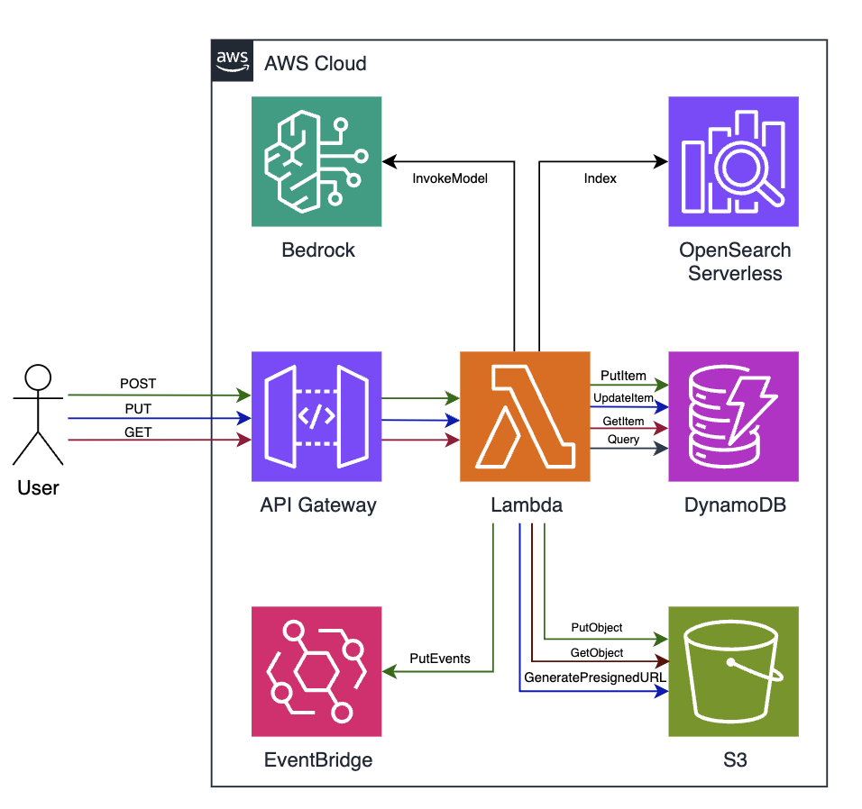
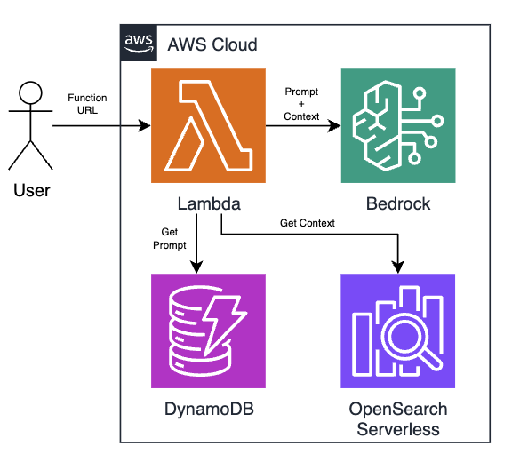

[](../../MRE-Developer-Guide.md)

# Developers Guide - Generative AI Features

Media Replay Engine (MRE) includes powerful Generative AI capabilities that enable natural language search, intelligent content analysis, and automated video understanding. This guide covers the three main GenAI features:

1. **Amazon Bedrock Integration for Plugins** - Using LLMs for intelligent video analysis
2. **Video Content Indexing with Amazon OpenSearch Service** - Semantic search capabilities
3. **GenAI RAG Search** - Natural language querying of video content

## Architecture Overview

### Indexing Classifier Plugin Results



### Generative AI Search



The GenAI features in MRE are built on a serverless architecture that integrates multiple AWS services:

### Core Components

**Amazon OpenSearch Serverless (AOSS)**
- **Vector Search Collection** - Stores 1024-dimensional embeddings using FAISS engine for semantic similarity search
- **Summary Collection** - Contains structured metadata and content summaries
- **KNN Index** - Enables fast vector similarity queries with configurable parameters (k=20, query size=30)

**Amazon Bedrock Integration**
- **Foundation Models** - Supports multiple foundational models including Amazon Nova Pro and Claude 3 Sonnet for content analysis
- **Embedding Models** - Amazon Titan Embed Text v2 generates vector representations of content
- **Cross-region Inference Profiles** - Provides high availability and automatic failover

**Lambda Function Architecture**
- **GenAI Search Handler** - Node.js 20.x runtime with 5-minute timeout for complex queries
- **Response Streaming** - Uses Lambda Function URLs with streaming response mode for real-time interaction
- **Custom Tools** - Built-in calculator, number comparison, and list sorting capabilities

**Data Storage**
- **DynamoDB Tables** - Conversation history storage with pay-per-request billing
- **System Configuration** - Centralized prompt template and model configuration management

### Data Flow

1. **Content Indexing** - Classifier plugin results are automatically embedded and stored in OpenSearch
2. **Query Processing** - User queries are converted to embeddings and matched against indexed content
3. **Context Assembly** - Retrieved content is formatted and combined with conversation history
4. **Response Generation** - Bedrock models generate structured responses with timestamps and summaries
5. **Session Management** - Conversation context is maintained across multiple interactions

### Security & Access

- **IAM Authentication** - Function URL secured with AWS IAM for API access
- **AOSS Access Policies** - Fine-grained permissions for collection and index access
- **Encryption** - DynamoDB tables use AWS-managed encryption with point-in-time recovery

## Amazon Bedrock Integration for Plugins

### Overview

MRE plugins can leverage Amazon Bedrock foundation models to perform intelligent analysis of video content. This enables sophisticated computer vision and natural language processing tasks without requiring custom ML models.

### Supported Use Cases

- **Visual Scene Analysis** - Describe what's happening in video frames
- **Object and Activity Detection** - Identify specific objects, people, or activities
- **Content Classification** - Categorize video segments based on visual content
- **Multi-modal Analysis** - Combine visual and textual analysis

### Creating Bedrock-Powered Plugins

#### Basic Plugin Structure

**Reference Implementation:** [DetectViaPrompt Plugin](../../samples/source/mre-plugin-samples/Plugins/DetectViaPrompt/DetectViaPrompt.py)

```python
import os
import cv2
import base64
import json
import boto3
from botocore.config import Config

from MediaReplayEnginePluginHelper import OutputHelper
from MediaReplayEnginePluginHelper import Status
from MediaReplayEnginePluginHelper import DataPlane
from MediaReplayEnginePluginHelper import ControlPlane

# Configure Bedrock client with retry logic
config = Config(retries={"max_attempts": 100, "mode": "standard"})
bedrock = boto3.client("bedrock-runtime", config=config)

# Default model - use cross-region inference profiles for better availability
BEDROCK_MODEL_ID = os.getenv(
    "BEDROCK_MODEL_ID",
    "us.anthropic.claude-3-sonnet-20240229-v1:0"
)

def lambda_handler(event, context):
    print(event)
    
    results = []
    mre_dataplane = DataPlane(event)
    mre_controlplane = ControlPlane()
    mre_outputhelper = OutputHelper(event)
    
    try:
        # Download video segment
        media_path = mre_dataplane.download_media()
        
        # Get prompt template from MRE system
        prompt = mre_controlplane.get_prompt_template(name="YourPromptName")
        
        # Process video frames
        results = process_video_with_bedrock(media_path, prompt["Template"], event)
        
        # Save results
        mre_outputhelper.add_results_to_output(results)
        mre_dataplane.save_plugin_results(results)
        mre_outputhelper.update_plugin_status(Status.PLUGIN_COMPLETE)
        
        return mre_outputhelper.get_output_object()
        
    except Exception as e:
        print(e)
        mre_outputhelper.update_plugin_status(Status.PLUGIN_ERROR)
        raise
```

#### Frame Processing with Bedrock

**Reference Implementation:** See the complete frame processing logic in [DetectViaPrompt.py lines 45-85](../../samples/source/mre-plugin-samples/Plugins/DetectViaPrompt/DetectViaPrompt.py)

```python
def process_video_with_bedrock(media_path, prompt, event):
    # Frame sampling configuration
    p_fps = int(event["Profile"]["ProcessingFrameRate"])  # e.g., 5
    v_fps = int(event["Input"]["Metadata"]["HLSSegment"]["FrameRate"])  # e.g., 25
    frame_rate = int(v_fps / p_fps)
    
    cap = cv2.VideoCapture(media_path)
    frame_data = []
    
    # Extract and encode frames
    while cap.isOpened():
        frame_id = cap.get(1)
        ret, frame = cap.read()
        
        if not ret:
            break
            
        # Sample frames based on processing FPS
        if frame_id % frame_rate == 0:
            has_frame, image_bytes = cv2.imencode(".jpg", frame)
            if has_frame:
                frame_data.append({
                    "frame_id": frame_id,
                    "image_data": base64.b64encode(image_bytes).decode("utf-8")
                })
    
    cap.release()
    
    # Prepare messages for Bedrock
    llm_messages = []
    
    # Add frame images (limit to avoid token limits)
    MAX_FRAMES = 20
    sampled_frames = frame_data[::max(round(len(frame_data)/MAX_FRAMES), 1)][:MAX_FRAMES]
    
    for i, frame in enumerate(sampled_frames):
        llm_messages.extend([
            {
                "type": "text",
                "text": f"Frame {i+1}:"
            },
            {
                "type": "image",
                "source": {
                    "type": "base64",
                    "media_type": "image/jpeg",
                    "data": frame["image_data"]
                }
            }
        ])
    
    # Add prompt
    llm_messages.append({
        "type": "text",
        "text": prompt["Template"]
    })
    
    # Call Bedrock
    response = call_bedrock_model(llm_messages)
    
    # Process response into MRE format
    return format_bedrock_response(response, frame_data)

def call_bedrock_model(messages):
    body = {
        "anthropic_version": "bedrock-2023-05-31",
        "max_tokens": 4096,
        "temperature": 0.2,
        "messages": [{"role": "user", "content": messages}]
    }
    
    response = bedrock.invoke_model(
        body=json.dumps(body),
        modelId=BEDROCK_MODEL_ID,
        accept="application/json",
        contentType="application/json"
    )
    
    return json.loads(response["body"].read())

def format_bedrock_response(response, frame_data):
    results = []
    
    # Extract analysis from Bedrock response
    analysis = response['content'][0]['text']
    
    # Create MRE result format
    result = {
        'Label': analysis,
        'Start': get_frame_timecode(frame_data[0]["frame_id"]),
        'End': get_frame_timecode(frame_data[-1]["frame_id"]),
        'Confidence': 0.9  # Adjust based on your use case
    }
    
    results.append(result)
    return results
```

### Best Practices for Bedrock Plugins

1. **Model Selection**
   - Use cross-region inference profiles for better availability
   - Choose appropriate models based on your use case (vision vs. text)
   - Consider cost and latency requirements

2. **Frame Sampling**
   - Limit frames to avoid token limits (typically 10-20 frames max)
   - Sample frames strategically based on content type
   - Consider video duration and processing requirements

3. **Error Handling**
   - Implement robust retry logic for Bedrock calls
   - Handle rate limiting and throttling
   - Provide fallback mechanisms

4. **Performance Optimization**
   - Cache prompt templates when possible
   - Optimize image encoding and sizing
   - Use appropriate timeout values

## Video Content Indexing with Amazon OpenSearch Service

### Overview

MRE automatically indexes video content and metadata in Amazon OpenSearch Service (AOSS) to enable semantic search capabilities. This creates searchable embeddings of video segments, transcripts, and analysis results.

### Indexing Architecture

The indexing system consists of:

- **Vector Search Collection** - Stores embeddings for semantic search
- **Summary Collection** - Stores structured metadata and summaries
- **Automatic Indexing Pipeline** - Processes plugin results and creates embeddings

### Index Structure

#### Vector Search Index (KNN)

**Implementation Reference:** See the complete index mapping in [AossIndexCreationHandler/lambda_function.py lines 45-75](../../source/api/dataplane/infrastructure/lambda/AossIndexCreationHandler/lambda_function.py)

```json
{
  "settings": {
    "index": {
      "knn": "true",
      "number_of_shards": 2,
      "number_of_replicas": 0
    }
  },
  "mappings": {
    "properties": {
      "End": {"type": "text"},
      "Event": {"type": "text"},
      "PluginName": {"type": "text"},
      "Program": {"type": "text"},
      "Start": {"type": "text"},
      "content": {"type": "text"},
      "embedding": {
        "type": "knn_vector",
        "dimension": 1024,
        "method": {
          "engine": "faiss",
          "space_type": "innerproduct",
          "name": "hnsw",
          "parameters": {}
        }
      }
    }
  }
}
```

### Indexing Process

#### Automatic Indexing

MRE automatically indexes content when:

1. The `--enable-generative-ai` flag was enabled during deployment, and
2. **Classifier Plugin Results** are saved to the data plane

**Data Plane Reference:** See the plugin result indexing implementation in [chalicelib/plugin.py lines 1-50](../../source/api/dataplane/runtime/chalicelib/plugin.py) for OpenSearch client setup and indexing patterns.

### Search Operations

#### Vector Search

```python
def search_similar_content(query_text, event_name=None, program_name=None):
    # Generate query embeddings
    query_embeddings = generate_embeddings(query_text)
    
    # Build filter
    filter_conditions = {"bool": {"must": []}}
    if event_name:
        filter_conditions["bool"]["must"].append(
            {"match_phrase": {"Event": event_name}}
        )
    if program_name:
        filter_conditions["bool"]["must"].append(
            {"match_phrase": {"Program": program_name}}
        )
    
    # Search query
    search_query = {
        "size": 30,
        "query": {
            "knn": {
                "embedding": {
                    "vector": query_embeddings,
                    "k": 20,
                    "filter": filter_conditions
                }
            }
        },
        "_source": False,
        "fields": ["content", "Program", "Event", "Start", "End"]
    }
    
    response = client.search(
        index="mre-knn-index",
        body=search_query
    )
    
    return response["hits"]["hits"]
```

## Generative AI Search

### Overview

**Complete Implementation:** See the full RAG search implementation in [GenAISearchHandler/index.mjs](../../source/api/search/infrastructure/lambda/GenAISearchHandler/index.mjs)

The GenAI RAG (Retrieval-Augmented Generation) search feature enables natural language querying of video content. Users can ask questions in plain English and receive intelligent responses based on indexed video content.

### Architecture Components

**Infrastructure Reference:** See the complete stack definition in [mre_genai_search_stack.py](../../source/api/search/infrastructure/stacks/mre_genai_search_stack.py)

1. **Search API** - Lambda function handling search requests
2. **Vector Retrieval** - Finding relevant content using embeddings
3. **Context Assembly** - Preparing retrieved content for LLM
4. **Response Generation** - Using Bedrock to generate natural language responses
5. **Conversation History** - Maintaining chat context across sessions

### API Usage

#### Basic Search Request

```bash
curl -X POST "https://your-mre-genai-search-endpoint/" \
  -H "Content-Type: application/json" \
  -d '{
    "SessionId": "unique-session-id",
    "Query": "Show me all the goals scored in the first half",
    "Program": "soccer-match-2024",
    "Event": "world-cup-final",
    "ModelId": "amazon.nova-pro-v1:0"
  }'
```

#### Response Format

```json
{
  "Summary": "Found 3 goals scored in the first half of the match",
  "Details": [
    {
      "Start": 15.5,
      "End": 25.2,
      "Title": "First Goal - Penalty Kick",
      "Content": "Player scores from penalty spot after foul in the box"
    },
    {
      "Start": 32.1,
      "End": 41.8,
      "Title": "Second Goal - Header",
      "Content": "Cross from the right wing results in header goal"
    },
    {
      "Start": 44.3,
      "End": 52.7,
      "Title": "Third Goal - Counter Attack",
      "Content": "Fast break leads to one-on-one finish"
    }
  ]
}
```

### Implementation Details

#### Search Flow

1. **Query Processing** - Parse user query and extract intent
2. **Embedding Generation** - Convert query to vector embeddings
3. **Vector Search** - Find relevant content in OpenSearch
4. **Context Preparation** - Assemble retrieved content into context
5. **LLM Generation** - Generate response using Bedrock
6. **Response Formatting** - Structure response with timestamps and details

#### Custom Tools Integration

**Tools Implementation:** See the complete tool definitions and implementations in [GenAISearchHandler/index.mjs lines 60-150](../../source/api/search/infrastructure/lambda/GenAISearchHandler/index.mjs)

The RAG search includes custom tools for enhanced functionality:

```javascript
// Calculator tool for time calculations
function calculatorTool({ expression }) {
  const expr = expression.replace(/[^0-9+\-*/().]/g, "");
  return Function("return " + expr)().toString();
}

// Number comparison for timestamp analysis
function numberCompareTool({ firstNumber, secondNumber }) {
  const result = Math.sign(firstNumber - secondNumber);
  switch (result) {
    case 1: return `${firstNumber} is greater than ${secondNumber}`;
    case 0: return `${firstNumber} is equal to ${secondNumber}`;
    case -1: return `${firstNumber} is less than ${secondNumber}`;
  }
}

// List sorting for chronological ordering
function sortListByKeyTool({ list, key }) {
  return JSON.stringify(list.sort((a, b) => a[key] - b[key]));
}
```

### Generative AI Search API Request Examples

```json
{
  "SessionId": "session-123",
  "Query": "Find scenes with celebrations after goals, lasting more than 10 seconds",
  "Program": "soccer-match",
  "Event": "championship-final"
}
```

#### Time-based Queries

```json
{
  "SessionId": "session-456",
  "Query": "What happened between minute 15 and 30?",
  "Program": "basketball-game",
}
```

### Configuration and Customization

#### Custom Prompt Templates

You can customize the search prompt template by navigating to the `aws-mre-shared-resources-System...` DynamoDB table in your MRE deployment and modifying the value for the item with key `MRE_GENAI_SEARCH_PROMPT`