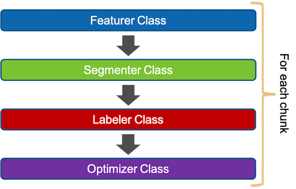
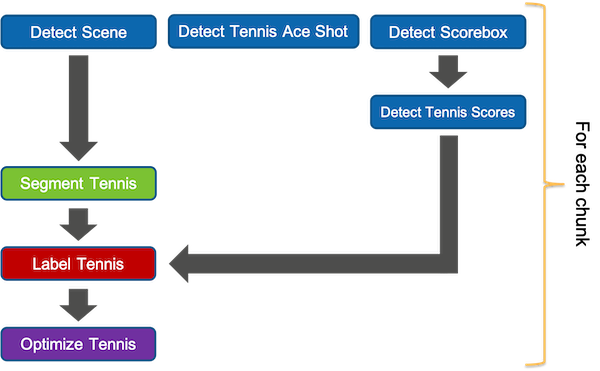

[](../../MRE-Developer-Guide.md)

# Developers Guide - Plugin Development

MRE Plugins are essential to processing the type of content you have as they are what allows for customization. Four classes of plugins exist in MRE:

- [Featurer](MRE-Developer-Guide-Featurer.md) - Detects useful data within the video frames MRE processes
- [Segmenter](MRE-Developer-Guide-Segmenter.md) - Determines the start and end of segments in the video stream
- [Optimizer](MRE-Developer-Guide-Optimizer.md) - Optionally improves the segmenter result to be more polished
- [Labeler](MRE-Developer-Guide-Labeler.md) - Optionally formats available segment data with a desirable label

The four plugin classes are orchestrated by the MRE automation to pass derrived results from Featurer to Segmenter. Then the Segmenter class plugins to both the Optimizer and Labeler class plugins in parallel. This is done to allow the plugins to depend on the availability of earlier plugin results.



Let's look at an example with tennis. It would be common to see several Featurer class plugins running in parallel to detect key data (tennis scene, ace shot detection) in the video chunk and then make that available to the Segmenter class plugin. Currently only one Segmenter class plugin (Segment Tennis) can be configured per profile. The Segmenter plugin can use the data from the Featurer class plugins (Detect Scene) combined with business logic to determine the beginning and end of a segment.

Optionally we've included an Optimizer class plugin called Optimize Tennis. This plugin will run after the Segment Tennis plugin. The optimization plugins can be customized to inspect different situations in audio or video that you want to consider to improve the segment in/out placement.

Also optional is the use of a Labeler class plugin. In this example, the Label Tennis plugin will use the extract tennis score data from the scorebox in a video frame to format a string that will be the label for new segments that are found. Labels are useful when reviewing results in the MRE console or can be used to provide a title for a segment when displayed to a viewer of the clips.



Plugins are written as AWS Lambda Functions. They **must** use the provided MRE Plugin Helper library which has been tested with Python 3.8 and is provided as a AWS Lambda Layer. Include this layer in all AWS Lambda functions that are intended to be MRE Plugins. It is called: **MediaReplayEnginePluginHelper**

It is suggested that MRE Plugin names start with a verb. For example,  DetectSilence, DetectTennisAceShot, OptimizeTennis, etc.

It is also suggested to use a consistent AWS resource tag such as **MRE** to track specific billing costs.

This baseline IAM Policy needs to be added a IAM Role you define and use with each AWS Lambda function that is intended to be registered in MRE as a plugin.

```
{
    "Version": "2012-10-17",
    "Statement": [
        {
            "Effect": "Allow",
            "Action": [
                "logs:CreateLogGroup",
                "logs:CreateLogStream",
                "logs:PutLogEvents"
            ],
            "Resource": "*"
        },
        {
            "Effect": "Allow",
            "Action": [
                "ssm:Describe*",
                "ssm:Get*",
                "ssm:List*"
            ],
            "Resource": "*"
        },
        {
            "Effect": "Allow",
            "Action": [
                "execute-api:Invoke",
                "execute-api:ManageConnections"
            ],
            "Resource": "arn:aws:execute-api:region:account-id:dataplane-api-id/*"
        }
    ]
}
```
NOTE: dataplane-api-id is the ID of the MRE Dataplane API Gateway endpoint


**To get plugin parameters**

Most of the plugin parameters needed for processing will be present in the lambda event payload. The parameters can be retrieved by their name from the “event” payload. For example, to get the model endpoint, use event[“ModelEndpoint”] and to get the configuration chosen for the plugin while creating the profile, use event[“Configuration”].


**To translate timecode from chunk runtime to UTC**

(Not really a UTC timecode but rather a chunk-specific timecode. In MRE, a chunk is referred to as an HLS segment)

```
from MediaReplayEnginePluginHelper import OutputHelper

mre_outputhelper = OutputHelper(event) # event is the input event payload passed to Lambda

mre_outputhelper.get_segment_absolute_time(1.3) # Assuming a chunk_size of 20 secs, for the first chunk, this will output 1.3 and for the second chunk, this will output 21.3 and so on.
```

**To persist plugin results:**

```
from MediaReplayEnginePluginHelper import DataPlane

mre_dataplane = DataPlane(event)
mre_dataplane.save_plugin_results(results)
```

**Expected output event for Lambda:**

```
from MediaReplayEnginePluginHelper import OutputHelper
from MediaReplayEnginePluginHelper import Status

mre_outputhelper = OutputHelper(event) # event is the “complete” event payload passed to Lambda

# When the plugin processing is successful:
# Update the processing status of the plugin (required):
mre_outputhelper.update_plugin_status(Status.PLUGIN_COMPLETE)

# Add the results of the plugin to the payload (required if the plugin status is “complete”; Optional if the plugin has any errors)
mre_outputhelper.add_results_to_output(results) → results is a list of JSON objects/dicts

# Finally, return the output event of Lambda
return mre_outputhelper.get_output_object()

# When the plugin processing is not successful and has encountered an error:
# Update the processing status of the plugin (required):
outputhelper.update_plugin_status(Status.PLUGIN_ERROR)

# Finally, return the output event of Lambda
return outputhelper.get_output_object()
```

**Which audio track to process:**

```
event[“TrackNumber”] gives the current audio track of the Step function Map state
```

A starter Lambda function is shown below. Reminder to include the MRE plugin helper Lambda Layer called: MediaReplayEnginePluginHelper

```
from MediaReplayEnginePluginHelper import OutputHelper
from MediaReplayEnginePluginHelper import Status
from MediaReplayEnginePluginHelper import DataPlane

def your_function_to_format_a_label(segments):
    results = []
    result = {}

    #loop through all the segments (0 to many) for this chunk   
    for segment in segments:
        #your logic to format a string to be the Label for this segment
        result['Label'] = 'TBD'
        results.append(result)        
    return results


def lambda_handler(event, context):
    print (event)

    results = []
    mre_dataplane = DataPlane(event)

    # 'event' is the input event payload passed to Lambda
    mre_outputhelper = OutputHelper(event)

    try:

        jsonResults = mre_dataplane.get_segment_state_for_labeling()
        print('jsonResults=',jsonResults)

        results = your_function_to_format_a_label(jsonResults)     
        print('results=',results)

        # Add the results of the plugin to the payload (required if the plugin status is "complete"; Optional if the plugin has any errors)
        mre_outputhelper.add_results_to_output(results)

        # Persist plugin results for later use
        mre_dataplane.save_plugin_results(results)

        # Update the processing status of the plugin (required)
        mre_outputhelper.update_plugin_status(Status.PLUGIN_COMPLETE)

        # Returns expected payload built by MRE helper library
        return mre_outputhelper.get_output_object()

    except Exception as e:
        print(e)

        # Update the processing status of the plugin (required)
        mre_outputhelper.update_plugin_status(Status.PLUGIN_ERROR)

        # Re-raise the exception to MRE processing where it will be handled
        raise

```

## Registering a plugin with MRE

Each plugin you want to use with MRE needs to be registered using the **plugin** API described here:

[POST /plugin](https://htmlpreview.github.io/?../source/output/api/controlplane.html#register-plugin)

Plugin registration provides the follow:
- context for the referenced AWS Lambda function
- the expected configuration parameters - these are captured from the user when configuring the **profile** in MRE
- expected output attributes - these are the data values that the plugin creates and will be leveraged later in the **replay** process and **exports**
- associated ML models - optionally, the plugin can designate which model versions a plugin is designed to work with. This helps guide **profile** creators into making appropriate selections.

Each plugin require an AWS Lambda ARN to be provided. Plugin versioning is maintained by MRE every time a registration call is made for a plugin with the same **name** attribute value.

Note that when the **SupportedMediaType** attribute is set to **Audio**, MRE will process each available audio track in parallel.
