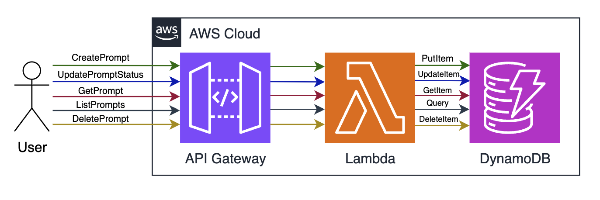

[](../../MRE-Developer-Guide.md)

# Developers Guide - Prompt Catalog

## Architecture Overview



## Prompt Catalog API Examples

The Prompt Catalog in MRE provides a way to create, manage, and use reusable prompt templates for generative AI applications. These examples demonstrate how to interact with the Prompt Catalog API using curl commands.

### API Implementation References

The Prompt Catalog API is implemented in the following files:

- **API Implementation**: [source/api/controlplane/promptcatalog/runtime/app.py](../../source/api/controlplane/promptcatalog/runtime/app.py)
- **Plugin Helper Library**: [source/lib/MediaReplayEnginePluginHelper/MediaReplayEnginePluginHelper/__init__.py](../../source/lib/MediaReplayEnginePluginHelper/MediaReplayEnginePluginHelper/__init__.py)

### Creating and Managing Prompts

#### Create a New Prompt

Create a new prompt template or publish a new version of an existing prompt:

```bash
curl -X POST "https://your-mre-endpoint/prompt" \
  -H "Content-Type: application/json" \
  -d '{
    "Name": "DescribeScenePrompt",
    "Description": "Analyzes video frames to describe the scene",
    "ContentGroups": ["Sports", "Football"],
    "Template": "Analyze these video frames and provide a detailed description of what is happening in the scene. Focus on: 1) Main activities or events, 2) Key objects or people visible, 3) Setting or environment, 4) Any notable changes between frames. Provide a concise but comprehensive description."
  }'
```

Response:
```json
{
  "Name": "DescribeScenePrompt",
  "Version": "v1"
}
```

**Code Reference**: [create_prompt function in app.py](../../source/api/controlplane/promptcatalog/runtime/app.py#L70)

#### List All Prompts

Retrieve the latest version of all available prompts:

```bash
# List only enabled prompts
curl -X GET "https://your-mre-endpoint/prompt/all"

# Include disabled prompts
curl -X GET "https://your-mre-endpoint/prompt/all?include_disabled=true"
```

Response:
```json
[
  {
    "Name": "DescribeScenePrompt",
    "Description": "Analyzes video frames to describe the scene",
    "ContentGroups": ["Sports", "Football"],
    "Template": "Analyze these video frames and provide a detailed description...",
    "Version": "v1",
    "Created": "2025-07-03T20:15:30.123Z",
    "Latest": 1,
    "Enabled": true
  },
  {
    "Name": "SummarizeHighlightPrompt",
    "Description": "Creates a summary of a highlight clip",
    "ContentGroups": ["Sports", "Basketball"],
    "Template": "Summarize this highlight clip in an exciting way...",
    "Version": "v2",
    "Created": "2025-07-02T18:45:12.456Z",
    "Latest": 2,
    "Enabled": true
  }
]
```

**Code Reference**: [list_prompts function in app.py](../../source/api/controlplane/promptcatalog/runtime/app.py#L196)

#### List Prompts by Content Group

Retrieve prompts filtered by a specific content group:

```bash
# List only enabled prompts for a content group
curl -X GET "https://your-mre-endpoint/prompt/contentgroup/Sports/all"

# Include disabled prompts for a content group
curl -X GET "https://your-mre-endpoint/prompt/contentgroup/Football/all?include_disabled=true"
```

Response:
```json
[
  {
    "Name": "DescribeScenePrompt",
    "Description": "Analyzes video frames to describe the scene",
    "ContentGroups": ["Sports", "Football"],
    "Template": "Analyze these video frames and provide a detailed description...",
    "Version": "v1",
    "Created": "2025-07-03T20:15:30.123Z",
    "Latest": 1,
    "Enabled": true
  }
]
```

**Code Reference**: [list_prompts_by_contentgroup function in app.py](../../source/api/controlplane/promptcatalog/runtime/app.py#L249)

#### Get a Prompt by Name

Retrieve the latest version of a specific prompt by name:

```bash
curl -X GET "https://your-mre-endpoint/prompt/DescribeScenePrompt"
```


Response:
```json
{
  "Name": "DescribeScenePrompt",
  "Description": "Analyzes video frames to describe the scene",
  "ContentGroups": ["Sports", "Football"],
  "Template": "Analyze these video frames and provide a detailed description...",
  "Version": "v1",
  "Created": "2025-07-03T20:15:30.123Z",
  "Latest": 1,
  "Enabled": true
}
```

**Code Reference**: [get_prompt_by_name function in app.py](../../source/api/controlplane/promptcatalog/runtime/app.py#L313)

#### Update Prompt Status

Enable or disable the latest version of a prompt:

```bash
curl -X PUT "https://your-mre-endpoint/prompt/DescribeScenePrompt/status" \
  -H "Content-Type: application/json" \
  -d '{
    "Enabled": false
  }'
```

This will disable the prompt, and it will no longer be returned in API calls unless `include_disabled=true` is specified.

**Code Reference**: [update_prompt_status function in app.py](../../source/api/controlplane/promptcatalog/runtime/app.py#L362)

#### Delete a Prompt

Delete all versions of a prompt by name:

```bash
curl -X DELETE "https://your-mre-endpoint/prompt/DescribeScenePrompt"
```

**Code Reference**: [delete_prompt function in app.py](../../source/api/controlplane/promptcatalog/runtime/app.py#L437)

### Managing Prompt Versions

#### List All Versions of a Prompt

Retrieve all versions of a specific prompt:

```bash
curl -X GET "https://your-mre-endpoint/prompt/DescribeScenePrompt/version/all"
```

Response:
```json
[
  {
    "Name": "DescribeScenePrompt",
    "Description": "Analyzes video frames to describe the scene",
    "ContentGroups": ["Sports", "Football"],
    "Template": "Analyze these video frames and provide a detailed description...",
    "Version": "v0",
    "Created": "2025-07-03T20:15:30.123Z",
    "Latest": 1,
    "Enabled": true
  },
  {
    "Name": "DescribeScenePrompt",
    "Description": "Analyzes video frames to describe the scene",
    "ContentGroups": ["Sports", "Football"],
    "Template": "Analyze these video frames and provide a detailed description...",
    "Version": "v1",
    "Created": "2025-07-03T20:15:30.123Z",
    "Latest": 1,
    "Enabled": true
  }
]
```

Note: Version "v0" is a special version that always contains a copy of the latest prompt revision.

**Code Reference**: [list_prompt_versions function in app.py](../../source/api/controlplane/promptcatalog/runtime/app.py#L362)

#### Get a Specific Version of a Prompt

Retrieve a specific version of a prompt:

```bash
curl -X GET "https://your-mre-endpoint/prompt/DescribeScenePrompt/version/v1"
```

Response:
```json
{
  "Name": "DescribeScenePrompt",
  "Description": "Analyzes video frames to describe the scene",
  "ContentGroups": ["Sports", "Football"],
  "Template": "Analyze these video frames and provide a detailed description...",
  "Version": "v1",
  "Created": "2025-07-03T20:15:30.123Z",
  "Latest": 1,
  "Enabled": true
}
```

**Code Reference**: [get_prompt_by_name_and_version function in app.py](../../source/api/controlplane/promptcatalog/runtime/app.py#L362)

#### Update a Specific Version's Status

Enable or disable a specific version of a prompt:

```bash
curl -X PUT "https://your-mre-endpoint/prompt/DescribeScenePrompt/version/v1/status" \
  -H "Content-Type: application/json" \
  -d '{
    "Enabled": false
  }'
```

**Code Reference**: [update_prompt_version_status function in app.py](../../source/api/controlplane/promptcatalog/runtime/app.py#L437)

#### Delete a Specific Version of a Prompt

Delete a specific version of a prompt:

```bash
curl -X DELETE "https://your-mre-endpoint/prompt/DescribeScenePrompt/version/v1"
```

Note: You cannot delete version "v0" or the latest prompt revision. If you need to delete the latest version, first publish a new version and then delete the previous one.

**Code Reference**: [delete_prompt_version function in app.py](../../source/api/controlplane/promptcatalog/runtime/app.py#L493)

### Using Prompt Templates in Plugins

The MRE Plugin Helper library provides a convenient way to access prompt templates in your plugins:

```python
from MediaReplayEnginePluginHelper import ControlPlane

def lambda_handler(event, context):
    # Initialize the control plane helper
    mre_controlplane = ControlPlane()
    
    # Get a prompt template by name
    prompt = mre_controlplane.get_prompt_template(name="DescribeScenePrompt")
    
    # Use the template in your generative AI application
    prompt_text = prompt["Template"]
    
    # Invoke Model and process the response
    # ...
```

**Code Reference**: [get_prompt_template method in MediaReplayEnginePluginHelper](../../source/lib/MediaReplayEnginePluginHelper/MediaReplayEnginePluginHelper/__init__.py#L1786)

### Best Practices for Prompt Templates

1. **Versioning**: Create new versions of prompts when making significant changes to ensure backward compatibility.

2. **Content Groups**: Organize prompts by content groups to make them easier to find and manage.

3. **Descriptive Names**: Use clear, descriptive names for your prompts that indicate their purpose.

4. **Testing**: Test your prompt templates with different inputs to ensure they produce the desired outputs.

5. **Reusability**: Design prompts to be reusable across different contexts when possible.