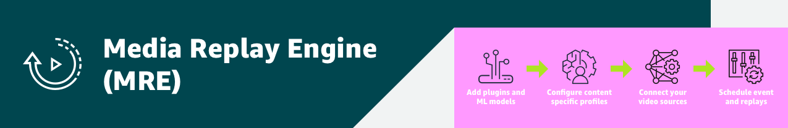

# Developers Guide - Replays

A **replay** in MRE is how you generate a filtered set of segments (clips) for an **event**. Multiple replay configurations can be added to an event, but they are not required. Replay configurations support generating a filtered and sequential output that support use cases such as:

- Highlight clips that fit within a designated total duration (i.e. 5 minutes of the best moments in a game)
- Clips that have a common feature (i.e. all the ace shots in a tennis match)
- Clips that feature a specific player

At this time, MRE supports the following options to configure a replay request:
- Duration (seconds)
- Weightings (0 to 100) for each featurer plugin output attribute value

Featurer plugins should designed and selected in a profile to generate the types of data that need to be leveraged in a replay request.

By default, replay requests are calculated at the completion of the event. However, a feature called **catch up** mode indicates that the replay should be calculated continually throughout an event as each new segment (clip) is detected. This feature supports the use case where an audience joins an event late and wants to see highlights to bring them up to speed before joining the event live.

The payload to the **replay** API takes a payload that is described here:

[POST /replay](https://htmlpreview.github.io/?https://github.com/awslabs/aws-media-replay-engine/blob/main/docs/source/output/api/controlplane-replay.html#add-replay)
